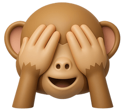
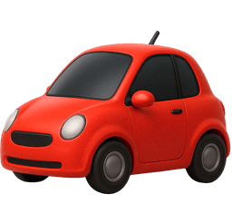
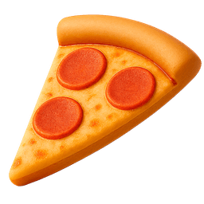
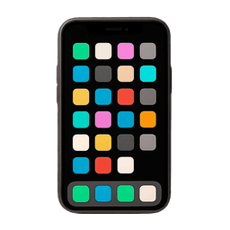
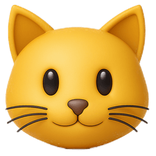
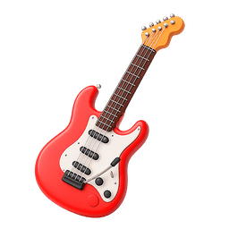

<p align="center">
  
</p>

<h1 align="center">VisionEmoji</h1>

<p align="center">
  <strong>Real-time object detection → emoji overlay, 100% on-device</strong>
</p>

<p align="center">
  Point your camera at anything and watch matching Apple emojis appear instantly.<br/>
  Powered by <a href="https://docs.ultralytics.com/models/yolo26/">YOLO26</a> and <a href="https://developer.apple.com/documentation/coreml">CoreML</a> on the Apple Neural Engine.
</p>

<p align="center">
  <a href="https://developer.apple.com/ios/"></a>
  <a href="https://developer.apple.com/swift/"></a>
  <a href="https://developer.apple.com/xcode/"></a>
  <a href="https://developer.apple.com/documentation/coreml"></a>
  <a href="https://developer.apple.com/machine-learning/"></a>
  <a href="PrivacyPolicy.md"></a>
</p>

<p align="center">
  <a href="https://apps.apple.com/us/app/vision-emoji/id6759308509">
    
  </a>
</p>

---

## Screenshots

<p align="center">
  
  &nbsp;
  
  &nbsp;
  
  &nbsp;
  
  &nbsp;
  
</p>

<p align="center">
  <em>Pet detection &nbsp;|&nbsp; Room scan &nbsp;|&nbsp; Kitchen &nbsp;|&nbsp; Workspace &nbsp;|&nbsp; Debug mode</em>
</p>

---

## Features

| Feature | Description |
|---|---|
| **80+ Object Categories** | Detects people, animals, vehicles, food, electronics, and more (COCO dataset) |
| **1,000+ Classifications** | ImageNet classification per detected object for precise emoji matching |
| **Real-Time Performance** | Interactive frame rates on the Apple Neural Engine, Kalman-filtered for stability |
| **Ultrawide Camera** | Maximum field of view to detect more objects simultaneously |
| **Privacy First** | 100% on-device — no internet, no data collection, no tracking, no ads |
| **Debug Mode** | Toggle bounding boxes, classification labels, and confidence scores |
| **Adjustable Settings** | Confidence threshold, emoji scale, label priority, smoothing mode |
| **Live Reload** | Unload and reload ML models on-the-fly without restarting |

---

## Architecture

```
CameraService (AVCaptureSession, ultrawide camera)
      | CVPixelBuffer
      v
VisionService (YOLO26m detection → per-object YOLO26m-cls classification)
      | [DetectionResult]
      v
EmojiOverlayService (Kalman filter smoothing, overlap resolution)
      | [EmojiOverlay]
      v
SwiftUI Overlay (EmojiOverlayView — positioned emoji renders)
```

All ML inference runs on a dedicated `DispatchQueue` at `.userInteractive` QoS. Results publish back to the main actor via Combine for SwiftUI rendering.

---

## Privacy

VisionEmoji **does not collect any data**. All processing runs entirely on-device.

See the full [Privacy Policy](PrivacyPolicy.md).

---

## License

MIT © 2026 [Aristides Lintzeris](mailto:aristideslintzeris@icloud.com)

---

<p align="center">
  Built with CoreML + SwiftUI
</p>

<p align="center">
  
  &nbsp;
  
  &nbsp;
  
  &nbsp;
  
  &nbsp;
  
  &nbsp;
  
  &nbsp;
  
  &nbsp;
  
  &nbsp;
  
  &nbsp;
  
</p>
